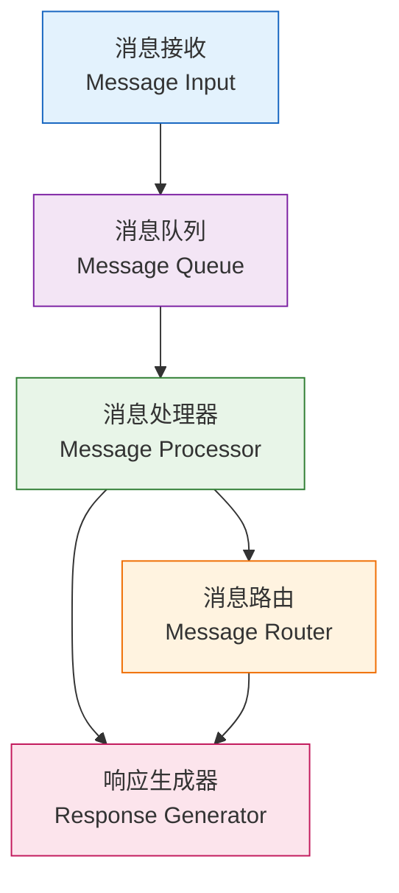

# 🚀 XianyuAutoAgent 后期规划路线图

> 基于 [@shaxiu](https://github.com/shaxiu) 原创项目的功能扩展和技术升级规划

## 🎯 近期重点功能

| 优先级 | 功能模块       | 描述                           | 预期效果               |
|--------|--------------|------------------------------|---------------------|
| 🔥 **P0** | **多模型支持**   | 支持多种LLM模型切换和负载均衡         | 提升响应稳定性和成本优化        |
| 🔥 **P0** | **身份识别切换** | 智能识别卖家/买家身份并自动切换对话策略 | 精准匹配不同角色的沟通需求      |
| 🔥 **P0** | **商品配置回复** | 支持配置在售商品开启自动回复功能       | 精细化商品管理和个性化回复      |
| 🔥 **P0** | **消息中间件**   | 独立的消息处理中间件模块             | 解耦消息处理逻辑，提升系统扩展性 |

## 🛠️ 技术架构升级

### 多模型引擎架构


```mermaid

flowchart TD
    A[模型调度器<br>Model Router]
    B[负载均衡器<br>Load Balancer]
    C[模型适配器<br>Model Adapter]
    
    D[通义千问<br>Qwen Model]
    E[GPT-4/3.5<br>OpenAI API]
    F[其他模型<br>Custom Models]
    
    A --> B
    B --> C
    C --> D
    C --> E
    C --> F

  ```

### 身份识别系统流程


```mermaid
flowchart TD
    A[消息输入]
    B[身份检测器<br>卖家/买家 角色识别]
    C[策略路由器]
    D[专家选择器]
    E[响应生成]
    
    F[卖家策略]
    G[买家策略]
    H[卖家专家]
    I[买家专家]
    
    A --> B
    B --> C
    
    C --> F
    C --> G
    
    F --> D
    G --> D
    
    D --> H
    D --> I
    
    H --> E
    I --> E
    
    %% 虚线连接表示角色识别对路由决策的影响
    B -.-> C
    B -.-> F
    B -.-> G
    
    %% 样式区分
    classDef logic fill:#e1f5fe,stroke:#01579b
    classDef strategy fill:#f3e5f5,stroke:#4a148c
    classDef expert fill:#e8f5e8,stroke:#2e7d32
    
    class A,E logic
    class B,C,D logic
    class F,G strategy
    class H,I expert

```

### 消息中间件架构




## 🧠 模型原子化训练计划

### 训练目标与策略

#### 🎯 核心训练目标
- **领域专精化**: 针对闲鱼场景的专业化模型训练
- **原子化能力**: 将复杂任务拆解为可独立训练的原子能力
- **持续学习**: 基于真实对话数据的增量学习机制

### 原子化能力模块

#### 1. 🏷️ 意图识别原子模块

```yaml
  模块名称: Intent Classification Atom
  训练数据: 
    - 闲鱼对话意图标注数据集 (10K+ samples)
    - 多轮对话上下文理解数据
  能力范围:
    - 询价意图识别 (准确率目标: 95%+)
    - 购买意图识别 (准确率目标: 93%+)
    - 技术咨询识别 (准确率目标: 90%+)
    - 售后服务识别 (准确率目标: 92%+)
```

#### 2. 💰 价格谈判原子模块

```yaml
  模块名称: Price Negotiation Atom
  训练数据:
    - 闲鱼议价对话数据集 (5K+ negotiations)
    - 成功/失败议价案例分析
  能力范围:
    - 价格合理性评估
    - 阶梯式降价策略
    - 心理价位探测
    - 成交概率预测
```

#### 3. 🎭 情感分析原子模块

```yaml
  模块名称: Emotion Analysis Atom
  训练数据:
    - 情感标注对话数据 (8K+ samples)
    - 用户满意度反馈数据
  能力范围:
    - 用户情绪状态识别 (开心/焦虑/愤怒/中性)
    - 情感强度量化 (1-10分)
    - 情感转化趋势预测
    - 情感驱动的回复策略
```

#### 4. 🛍️ 商品理解原子模块

```yaml
  模块名称: Product Understanding Atom
  训练数据:
    - 商品描述与问答配对数据 (15K+ pairs)
    - 商品属性提取标注数据
  能力范围:
    - 商品特征提取和理解
    - 商品相关问题自动回答
    - 商品推荐和比较
    - 库存状态智能回复
```

## 📋 功能开发计划

### Phase 1: 核心架构升级 (预计2-3周)

#### 多模型支持框架

- 模型适配器接口设计
- 配置化模型切换
- 模型性能监控

#### 身份识别系统

- 对话上下文分析
- 卖家/买家行为模式识别
- 动态策略切换机制

### Phase 2: 业务功能增强 (预计3-4周)

#### 商品配置管理

- 商品回复开关配置
- 个性化回复模板
- 商品状态同步

#### 消息中间件

- 异步消息处理
- 消息优先级队列
- 失败重试机制

### Phase 3: 智能化提升 (预计4-5周)

#### 情感分析模块

- 用户情绪识别
- 情感驱动的回复策略

#### 市场比价功能

- 实时价格监控
- 智能定价建议

#### 网络搜索增强

- 实时信息检索
- 知识图谱集成

### Phase 4: 运维管理 (预计2-3周)

#### RAG知识库

- 向量数据库集成
- 知识检索优化

#### Web管理界面

- 可视化配置面板
- 实时监控大屏
- 数据统计分析

## 🎨 配置示例

### 多模型配置

```yaml
# config/models.yml
models:
  primary:
    name: "qwen-max"
    endpoint: "https://dashscope.aliyuncs.com/api/v1/"
    fallback: "gpt-3.5-turbo"
  
  secondary:
    name: "gpt-4"
    endpoint: "https://api.openai.com/v1/"
    
load_balancer:
  strategy: "round_robin"  # round_robin, weighted, failover
  health_check: true
```

### 身份识别配置

```yaml
# config/identity.yml
identity_detection:
  seller_keywords: ["我的商品", "出售", "价格", "库存"]
  buyer_keywords: ["购买", "多少钱", "包邮吗", "什么时候发货"]
  
strategies:
  seller:
    tone: "professional"
    focus: ["product_info", "pricing", "logistics"]
  buyer:
    tone: "friendly"  
    focus: ["purchase_guide", "after_sales", "recommendations"]

```

### 原子化模型配置

```yaml
# config/atom_models.yml
atomic_models:
  intent_classifier:
    model_path: "./models/intent_bert"
    confidence_threshold: 0.85
    
  price_negotiator:
    model_path: "./models/price_chatglm"
    max_discount_rate: 0.3
    
  emotion_analyzer:
    model_path: "./models/emotion_roberta"
    emotion_weights:
      positive: 1.2
      negative: 0.8
      
  product_expert:
    model_path: "./models/product_t5"
    knowledge_base: "./data/product_kb.json"

```

## 📈 成功指标

### 技术指标

- 响应速度: 平均响应时间 < 2秒
- 准确率: 意图识别准确率 > 90%
- 用户满意度: 4.5/5.0 以上
- 系统稳定性: 99.9% 可用性

### 业务指标

- 转化率提升: 相比人工客服提升 15%+
- 响应效率: 24/7 无间断服务
- 成本节约: 人力成本降低 60%+
- 用户体验: 平均等待时间 < 30秒

## 🔗 相关资源

- 原项目地址: [XianyuAutoAgent](https://github.com/shaxiu/XianyuAutoAgent)
- 技术文档: 详见主项目 README.md
- 问题反馈: 请到原仓库提交 Issue
- 贡献指南: 遵循原作者的开源协议